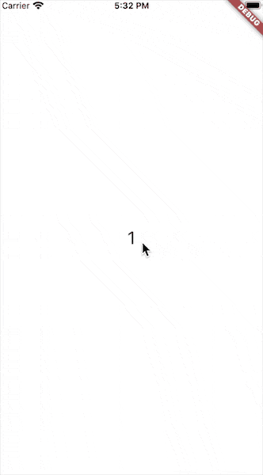

# flutter_steps_animation

一个强大的动画库，可以让你分布完成一个复杂动画

## 一个简单的例子



## 添加依赖

添加依赖:

```yaml
dependencies:
  flutter_steps_animation: ^1.1.0
```

## 代码示例

使用StepsAnimation和平常的Animation没有太多不同：

```dart
class AnimationPageState extends State<AnimationPage>
    with SingleTickerProviderStateMixin {
  StepsAnimation stepsAnimation;

  @override
  Widget build(BuildContext context) {
    return Scaffold(
      body: Container(
        color: Colors.white,
        child: GestureDetector(
          onTap: () {
            _playAnimation(stepsAnimation.controller);
          },
          child: Center(
            child: AnimatedBuilder(
              animation: stepsAnimation.controller,
              builder: stepsAnimation.builder,
            ),
          ),
        ),
      ),
    );
  }

  @override
  void initState() {
    super.initState();
    stepsAnimation = StepsAnimationBuilder()
        .addStepBuilder(_timeAnimation(1))
        .addStepBuilder(_timeAnimation(2))
        .addStepBuilder(_timeAnimation(3))
        .addStepBuilder(_multipleAnimation())
        .addStepBuilder(_waitStep(2))
        .addStepBuilder(_moreStepsAnimation())
        .animation(this);
  }

  Future<Null> _playAnimation(AnimationController controller) async {
    try {
      await controller.forward().orCancel;
      await controller.reverse().orCancel;
//      controller.reset();
    } on TickerCanceled {}
  }

  @override
  void dispose() {
    stepsAnimation.controller.dispose();
    super.dispose();
  }

```

添加步骤，每个步骤的持续时间相加，即为整个动画的持续时间

```dart
stepsAnimation = StepsAnimationBuilder()
        .addStepBuilder(_timeAnimation(1))
        .addStepBuilder(_timeAnimation(2))
        .addStepBuilder(_timeAnimation(3))
        .addStepBuilder(_multipleAnimation())
        .addStepBuilder(_waitStep(2))
        .addStepBuilder(_moreStepsAnimation())
        .animation(this);
```

示例图片中，所有动画的代码，看着很长，其实真的很简单

```dart
SingleAnimationBuilder _timeAnimation(int number) {
    final duration = Duration(milliseconds: 500);
    return SingleAnimationBuilder(
      duration: duration,
      buildInfo: SingleAnimationBuildInfo(
          animatable: Tween<double>(begin: 25, end: 100),
          from: Duration.zero,
          duration: duration),
      buildAnimation: (context, data) {
        return Text(
          '$number',
          style: TextStyle(fontSize: data.value),
        );
      },
    );
  }

  MultipleAnimationBuilder _multipleAnimation() {
    final duration = Duration(seconds: 10);
    final builder = MultipleAnimationBuilder(
        duration: duration,
        buildAnimation: (context, map) {
          final Color color = map['color'].value;
          final complementaryColor = Color(0xffffff ^ color.value);
          return ClipRRect(
            borderRadius:
                BorderRadius.all(Radius.circular(map['radius'].value)),
            child: Container(
              height: map['height'].value,
              width: map['width'].value,
              color: color,
              child: Center(
                child: Text(
                  '${map['color'].value}',
                  style: TextStyle(color: complementaryColor),
                ),
              ),
            ),
          );
        });
    builder
        .addAnimatable(
            animatable: Tween<double>(begin: 100, end: 400),
            from: Duration.zero,
            duration: Duration(seconds: 4),
            key: 'height')
        .addAnimatable(
            animatable: Tween<double>(begin: 400, end: 100),
            from: Duration(seconds: 5),
            duration: Duration(seconds: 5),
            key: 'height')
        .addAnimatable(
            animatable: Tween<double>(begin: 400, end: 150),
            from: Duration.zero,
            duration: Duration(seconds: 4),
            key: 'width')
        .addAnimatable(
            animatable: Tween<double>(begin: 150, end: 400),
            from: Duration(seconds: 5),
            duration: Duration(seconds: 3),
            key: 'width')
        .addAnimatable(
            animatable: ColorTween(
                begin: Colors.green[400], end: Colors.yellowAccent[700]),
            from: Duration(seconds: 2),
            duration: Duration(seconds: 4),
            key: 'color')
        .addAnimatable(
            animatable: ColorTween(
                begin: Colors.yellowAccent[700], end: Colors.red[800]),
            from: Duration(seconds: 7),
            duration: Duration(seconds: 3),
            key: 'color')
        .addAnimatable(
            animatable: Tween<double>(begin: 0, end: 200),
            from: Duration(seconds: 3),
            duration: Duration(seconds: 2),
            key: 'radius')
        .addAnimatable(
            animatable: Tween<double>(begin: 200, end: 0),
            from: Duration(seconds: 6),
            duration: Duration(seconds: 3),
            key: 'radius');
    return builder;
  }

  NoneAnimationBuilder _waitStep(int second) {
    return NoneAnimationBuilder(
        duration: Duration(seconds: second),
        builder: (context) {
          return Container(
            color: Colors.black,
            height: 100,
            width: 400,
            child: Center(
              child: Text(
                'just wait ${second}s',
                style: TextStyle(color: Colors.white),
              ),
            ),
          );
        });
  }

  SingleAnimationBuilder _moreStepsAnimation() {
    return SingleAnimationBuilder(
      duration: Duration(seconds: 10),
      buildAnimation: (context, animation) {
        return Container(
          color: Colors.black,
          height: animation.value,
          width: 400,
          child: Center(
            child: Text(
              'more steps',
              style: TextStyle(color: Colors.white),
            ),
          ),
        );
      },
      buildInfo: SingleAnimationBuildInfo(
        animatable: Tween<double>(begin: 100, end: 1000),
        from: Duration.zero,
        duration: Duration(seconds: 8),
      ),
    );
  }
```


